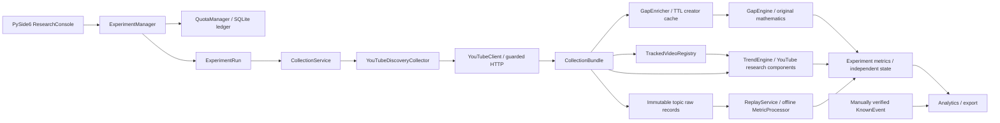

# CreatorRadar / CR:Correlator Research Console

A local Windows desktop laboratory for Gap and YouTube Trend research. Raw observations are saved first; deterministic calculations, experiment configuration and evaluation annotations are kept separately. This is research software, not the CreatorRadar SaaS or a validated forecasting system.

## Windows setup and launch

Use Python 3.12 and the existing checkout:

```powershell
cd "F:\!Life\Business\CreatorRadar\CR_API"
py -3.12 -m venv .venv
.\.venv\Scripts\Activate.ps1
python -m pip install -r requirements.txt
if (!(Test-Path .env)) { Copy-Item .env.example .env }
notepad .env
python -m research
```

If PowerShell blocks activation, activation is optional:

```powershell
.\.venv\Scripts\python.exe -m pip install -r requirements.txt
.\.venv\Scripts\python.exe -m research
```

Configure `.env` locally:

```dotenv
YOUTUBE_API_KEY_DEFAULT=
YOUTUBE_API_KEY_NICK=
CREATORRADAR_DEFAULT_API_PROFILE=DEFAULT
```

Fill at least one key using your own enabled YouTube Data API project. Empty profiles are not offered. The GUI displays **profile names only**; one experiment keeps one profile. Environment variables override `.env`. The old `YOUTUBE_API_KEY` variable remains a DEFAULT fallback. There is no automatic key rotation. Restart after editing `.env`.

`python -m research --debug` enables detailed application logging. Requests/urllib3 DEBUG logging stays disabled to prevent URL/key disclosure. Never add secrets to experiment JSON, templates, code or screenshots.

## What happens after Run

1. `ExperimentForm` creates `ExperimentConfig` from the UI.
2. `ExperimentManager` validates it, resolves complete formula parameters and estimates the whole run.
3. A quota-unsafe plan is rejected before any network request. `TopicWorkspaceManager` saves the immutable experiment snapshot for an accepted run.
4. `ResearchWorker` runs `ExperimentRun` outside the GUI thread.
5. `CollectionService` calls `YouTubeDiscoveryCollector`: fixed/rolling bounds → paginated search → within-batch dedupe → video details in groups of 50.
6. The collector returns a shared, unfiltered `CollectionBundle`. Raw data are saved even when incomplete.
7. Gap receives separate creator enrichment; Trend receives the original observations and publication identities.
8. `MetricProcessor` saves independent metric series and state. Tracking refreshes counters with `videos.list`, never with search.
9. Analytics reads stored JSONL/CSV. Known Events are added only after calculation. Replay can rerun the same raw references with new parameters without a client or credentials.



## Actual component tree

```text
ResearchConsole (research/gui.py)
├── ExperimentForm (gui_form.py): topics, modes, windows, formulas, quota
├── AnalyticsPanel (gui_analytics.py): series, overlays, event axis, exports
├── ResearchWorker: background application commands
├── ExperimentManager (application.py): validate, resolve formulas, preflight
│   ├── QuotaManager (quota.py): separate daily search/read pools
│   ├── ExperimentRun (execution.py): finite lifecycle and cancellation
│   │   ├── TopicScheduler (scheduling.py): explainable exploration/monitoring
│   │   ├── CollectionService (collection.py): discovery and tracking
│   │   │   └── YouTubeDiscoveryCollector (discovery.py)
│   │   │       ├── YouTubeSearchService (youtube/search.py)
│   │   │       ├── YouTubeVideoService (youtube/videos.py)
│   │   │       └── YouTubeClient (youtube/client.py)
│   │   ├── GapEnricher (gap.py): cached creator baselines
│   │   ├── MetricProcessor (processing.py)
│   │   │   ├── GapEngine → original metrics/engine.py
│   │   │   ├── TrendEnricher + TrendEngine (trend.py)
│   │   │   ├── TrackedVideoRegistry (tracking.py)
│   │   │   └── HistoricalAnalyzer (evaluation.py)
│   │   └── ProductReport (reporting.py)
│   └── TopicWorkspaceManager (storage.py)
└── ReplayService (replay.py) → same network-free MetricProcessor
    EventEvaluator (evaluation.py) annotates results separately
```

## Modes and exact workflows

**Quick Gap Test:** select DEFAULT, Quick Gap Test, topic `AI laptop`, ROLLING, explicit From/To bounds, and one page. Their difference is the rolling width; there is no separate Rolling hours field. Estimate, then Run. After the run, select Analytics and `gap: gap_score`, `er_batch`, `pr_batch`, `demand`, `supply`, creator authority or normalization boundaries. The details panel contains all intermediate fields. An ineligible/empty batch produces an explicit warning, not a fabricated score.

`Discovery → raw → cached creator baseline → original GapEngine → Gap metrics`

**Quick Trend Test:** select topic `GTA VI` or a narrower query, Quick Trend Test, a 24h From/To range, duration 4 hours, discovery 30 minutes, tracking 15 minutes. Review the cost estimate. Increase pages or narrow the query if collection is capped. One short run can show observations; derivatives, causal normalization and publish gates need multiple complete measurement windows.

`Discovery → publication buckets → EWMA / velocity / G / Z / breadth; counters → actual deltas / E_YT → research diagnostics`

**Combined Research:** enter one topic or semicolon-separated topics, choose Combined Research. One search result stream feeds both branches. For longer runs, adjust page size, baseline settings and duration until the conservative estimate fits the tester's actual limits.

`One discovery → raw → {Gap enrichment + GapEngine; TrendEnricher + TrendEngine}`

**Product Simulation:** choose Product Simulation and a pool such as Gaming, or enter custom topics. Set exploration percentage, run duration and quota limits in Settings. The scheduler selects one topic per discovery slot, persists its reason, and tracks already registered videos on a separate cadence. Read `product_report.json`, `events.jsonl`, `summary.json` and Analytics afterward.

`Pool → deterministic scheduler → selected discovery → Gap + Trend → feedback; registered videos → cheap tracking`

**Historical Event Validation:** select STATIC, a verified publication range, and topic. This mode performs one discovery pass and plots sampled publication counts/creator breadth. Choose Analytics → Add verified event or Import events JSON. Select the event and enable Hours relative to event. Known event records need topic ID, name/type/time, description, source URL/type and verification timestamp. No real-world event dates are bundled or invented. Save/load experiment templates to repeat a historical window.

`Historical publication search → publication histogram → independent event overlay`

**Historical snapshot validation:** if counters were actually recorded in the past, replay that experiment and overlay a Known Event on its calculated series. Current YouTube counters cannot reconstruct historical hourly views, engagement, acceleration, or historical Gap.

**Replay / comparison:** choose an existing experiment in Replay, Ctrl-select balanced/conservative/sensitive formula files, then Replay / compare. Gap parameters come from Settings. New derived experiments appear in Analytics. The comparison plot overlays the first topic's EWMA; any result's other metrics are available through Analytics. Replay needs the referenced topic raw files and captured Gap enrichment. It never refreshes a missing baseline from YouTube.

`Verified raw + stored enrichment + formula A/B/C → fresh independent states → new result workspaces; zero network`

## Trend semantics and limitations

The supplied MathCore notebook is documented in [FORMULAS.md](docs/FORMULAS.md). Its production Trend Score requires fixed-panel incidence and several platforms. Query search supplies neither the eligible denominator nor Reddit/News. Consequently **`trend_score` is always null** in this YouTube-only application.

`youtube_research_score` is a separately named, versioned experimental adaptation of supported components. Its parameters, reduced formulas, conservative effective support and heuristic lifecycle are documented; it must not be presented as production Trend Score or a probability. Missing metrics stay null. Capped/incomplete search does not update a complete-window baseline. Cold-start G/Z/breadth and reaction percentiles need prior observations. Known Events never enter the engines.

Historical search is a sample, not a complete census. Blank publication buckets are not filled with invented zeros. The historical mode does not infer the date of a real event. For stronger validation, prepare manually verified strong, medium, weak/failed and control cases, then keep tuning and held-out periods separate.

## Quota, profiles and API optimizations

- Defaults: 100 search calls/day, 10,000 other read units/day, 10% reserve; all limits are configurable. These reflect the documented granular pools, not the old assumption that every search belongs to a single shared unit pool. Verify your project's actual limits in Google Cloud. [Official overview](https://developers.google.com/youtube/v3/getting-started), [search endpoint](https://developers.google.com/youtube/v3/docs/search/list).
- Separate SQLite ledger entries by profile and Pacific date. Each attempted call, including failures/retries, is charged before transmission. Concurrent instances share atomic accounting. Local records cannot see usage by other programs or keys in the same Cloud project; do not treat separate profile names as separate projects without checking.
- Preflight estimates use worst-case cold caches and retry allowance. Runtime guards protect each operation. Search exhaustion stops new discovery; an available read pool may continue registered counter tracking. No automatic switch to another key.
- Incremental rolling lower bound: `max(current_window_from, last_complete_uncapped_end - overlap)`. `publishedBefore` is always the current effective To. Failed/capped results never advance the watermark.
- Search uses `nextPageToken`, configured page caps and repeated-token protection. IDs are unique inside a batch; observations of the same video at different times are preserved.
- Video/channel detail reads are batched to 50. Creator playlist reads are bounded. Gap caches uploads IDs, selected baseline IDs, raw counters and refresh timestamps for a configurable TTL. Quick Trend and historical publication mode never fetch creator baselines.
- Retries: only transient HTTP 429/500/502/503/504 or temporary transport failures; exponential delay with jitter, finite attempts. HTTP errors omit URL, body and key.

The 1.45% empirical cost from the original PoC is not hardcoded. All quota displays say **Local estimate**. The legacy CLI remains available for old scripts but its original collector does not participate in the desktop quota ledger.

## Storage and reproducibility

```text
data/
├── quota.sqlite                 # atomic daily per-profile local ledger
├── creator_cache.json           # replaceable TTL acceleration cache
├── research.log                 # technical logs, no credentials
└── topics/<topic_id>/
    ├── topic.json
    ├── configs/<experiment_id>.json
    └── raw/<batch_id>.json      # immutable schema 2.0 CollectionBundle
experiments/<experiment_id>/
├── experiment.json             # immutable full requested config + hash + versions
├── runtime.json                # start time and normalized initial effective windows
├── topics.json
├── inputs.jsonl                # raw references and content checksums
├── enrichment/*.json           # captured immutable Gap inputs
├── enrichment_manifest.jsonl   # baseline checksums
├── telemetry.jsonl
├── events.jsonl                # execution journal
├── known_events.jsonl          # independent evaluation annotations
├── quota.json
├── summary.json
├── product_report.json         # Product Simulation only
├── state/<topic_id>/{gap,trend,tracking,discovery}.json
└── results/<topic_id>/{gap,trend,tracking,historical}.{jsonl,csv}
```

Metrics and state are scoped to **experiment + topic**, avoiding contamination between formula configurations. The topic directory holds shared raw observations. Raw schema 1 from the original PoC remains readable with the original `python replay.py`; it is not silently converted to schema 2. Original CLI entry points `main.py`, `scheduler.py`, `replay.py`, `build_dataset.py` are retained.

JSON and CSV exports are local. Derived metrics may be recalculated; raw files are exclusive-create and checksum verified. Do not edit raw files to repair a run. Preserve the dataset and logs, fix the reader/migration, then replay into a new result workspace. Endless runs pause in-process on daily quota exhaustion and resume the same experiment after the timezone-aware Pacific reset; process restart recovery remains outside this scope.

## Publication windows and video eligibility

STATIC keeps its effective From/To fixed for the whole run. If selected To is newer than `now - minimum_video_age`, only To is capped; From stays fixed. Run is rejected if that produces an empty interval.

ROLLING uses the selected initial From/To difference as its only window width. If To is too new, the whole range shifts backward, preserving that width. Runtime bounds equal the normalized initial bounds plus monotonic elapsed experiment time, so a 24-hour range remains exactly 24 hours while moving. The form preview and collector use the same `WindowResolver`.

Examples:

- STATIC: Sep 10 00:00 → Sep 12 00:00 never moves.
- ROLLING: Sep 17 10:00 → Sep 18 10:00 becomes Sep 17 11:00 → Sep 18 11:00 after one real hour.
- ROLLING with a 24h width and minimum age 1h covers approximately videos 1h through 25h old. The minimum-age gap does not shrink the 24h publication interval.

Search uses both `publishedAfter` and `publishedBefore`. After batched `videos.list`, actual `publishedAt` is checked again. `Minimum views` defaults to 1000 and is inclusive: 999 is excluded; 1000 is eligible. Missing `viewCount` is excluded with `MISSING_VIEW_COUNT` when the threshold is positive. A zero threshold permits a missing view count. Discovery identities remain in raw provenance, while only eligible observations enter Historical, Gap, Trend, tracking registration and Correlator-ready derived results.

Total Duration is stored in hours; discovery and counter-tracking cadences remain minutes. Old `duration_minutes` templates load as hours, and legacy `rolling_hours` templates are materialized as explicit From/To bounds. New saves contain no independent rolling-hours value.

With **Run until manually stopped**, Duration is ignored. Cost preview reports rates per hour and Pacific day rather than a finite total. Local or server-reported daily quota exhaustion enters `WAITING_FOR_QUOTA`, performs no API calls while waiting, keeps Stop active, and resumes the same experiment at the next `America/Los_Angeles` midnight. No API profile/key rotation occurs.

## Development and tests

```powershell
cd "F:\!Life\Business\CreatorRadar\CR_API"
.\.venv\Scripts\python.exe -m pip install -r requirements-dev.txt
.\.venv\Scripts\python.exe -m pytest -q
.\.venv\Scripts\python.exe -m ruff check research youtube/client.py youtube/search.py youtube/videos.py tests/test_research*.py
```

Tests use fake responses and offscreen Qt, never live API quota. The suite covers original Gap regression, modes, shared discovery, retries, quotas, pagination, cache, raw integrity, tracking, historical separation, event alignment, replay and GUI worker/analytics integration.

Work stays in `research_gui_trend_gap`, based on the existing `origin/alpha_test` ref. Do not develop on main/alpha_test or overwrite user work. Commits are local only. Nothing is pushed, and no PR is created.

See [architecture](docs/ARCHITECTURE.md), [developer guide](docs/DEVELOPER_GUIDE.md), [formula provenance](docs/FORMULAS.md), [initial audit](docs/AUDIT.md), and [implementation report](docs/IMPLEMENTATION_REPORT.md).

## Troubleshooting

| Symptom | Action |
|---|---|
| Invalid interpreter in PyCharm | Select this checkout's `.venv\Scripts\python.exe`; set working directory to the project root. |
| Activation denied | Use the explicit `.venv\Scripts\python.exe` commands above. |
| Missing `.env`, key or profile | Copy `.env.example` only if `.env` is absent; fill the selected profile and restart. |
| Quota exhausted / budget blocked | Check configured limits and Cloud Console; reduce duration/pages or wait for reset. No auto rotation. |
| Missing PySide6/pyqtgraph | Install requirements with the same interpreter that launches the GUI. |
| Empty search results | Check query, UTC bounds and API project permissions. Valid empty results differ from failed requests. |
| Partial/capped response | Inspect warnings/status/truncated in raw metadata; raise page cap or narrow the query; do not treat it as zero signal. |
| Trend components null | Check complete window coverage, prior baseline windows and publish-gate details. Production score is intentionally unavailable. |
| Gap unavailable | Check creator minimum, playlist page cap, missing counters and cache TTL. Trend raw data remain available. |
| Replay dataset missing | Restore the experiment and its referenced `data/topics` files together; never fetch substitutes during replay. |
| Corrupt state or raw files | Preserve files; inspect logs/checksums. New replay derives fresh state from intact raw inputs. |
| Stop is not immediate | The current HTTP call has a 30-second timeout; cancellation is checked before every following request. |
| Old CLI quota differs | Legacy collection is outside the desktop ledger; use GUI for guarded research runs. |
