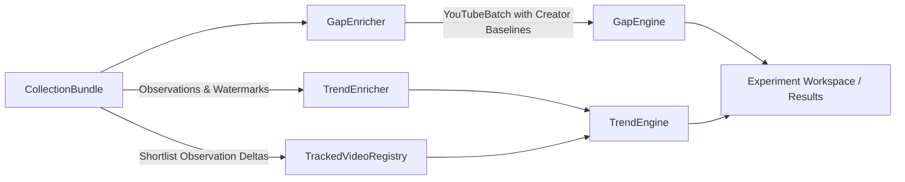

# System Architecture

CreatorRadar Research is a modular desktop research laboratory designed for deterministic YouTube trend analysis and content gap detection. The codebase enforces strict separation of concerns across presentation, orchestration, domain logic, mathematical calculation, and infrastructure.

For a step-by-step description of data collection, enrichment, and storage, see [DATA_PIPELINE.md](file:///d:/Programming/Projects/GitHub/CR_ytAPI/docs/DATA_PIPELINE.md).

---

## 1. Architectural Layers & Responsibilities

The codebase is partitioned into six cohesive subpackages under `research/`:

```
┌─────────────────────────────────────────────────────────────┐
│                      Presentation Layer                     │
│                 research.gui (PySide6 / GUI)                │
└──────────────────────────────┬──────────────────────────────┘
                               │ Dispatches background tasks
┌──────────────────────────────▼──────────────────────────────┐
│                     Orchestration Layer                     │
│                   research.orchestration                    │
│    (ExperimentManager, ExperimentRun, CollectionService)    │
└──────────────┬──────────────────────────────┬───────────────┘
               │                              │
┌──────────────▼──────────────┐┌──────────────▼───────────────┐
│     Mathematical Engines    ││     Infrastructure / I/O     │
│       research.metrics      ││   research.api & research.   │
│ (GapEngine, TrendEngine,    ││            storage           │
│       Calculators)          ││ (YouTubeClient, QuotaManager,│
│    * Strictly Network-Free* ││    TopicWorkspaceManager)    │
└──────────────▲──────────────┘└──────────────▲───────────────┘
               │                              │
               └──────────────┬───────────────┘
                              │ Uses typed contracts
┌─────────────────────────────┴───────────────────────────────┐
│                         Core Domain                         │
│                        research.core                        │
│          (Domain Models, Time Utilities, Enums)             │
└─────────────────────────────────────────────────────────────┘
```

### Layer Summary

| Package | Purpose | Key Classes / Modules |
|---|---|---|
| **`research.core`** | Immutable domain entities, data models, contracts, and UTC time utilities. | `CollectionBundle`, `VideoObservation`, `ExperimentConfig`, `CandidateTopic`, `now_utc`, `iso`. |
| **`research.api`** | External YouTube Data API v3 boundary, guarded HTTP sessions, retry logic, and SQLite quota tracking. | `YouTubeClient`, `QuotaManager`, `YouTubeDiscoveryCollector`, `ApiProfiles`. |
| **`research.metrics`** | Network-free mathematical algorithms for Gap and Trend detection, creator baselines, tracking registries, and event analysis. | `GapEngine`, `GapEnricher`, `TrendEngine`, `TrendEnricher`, `MetricProcessor`, `calculators.py`. |
| **`research.orchestration`** | Runtime lifecycle coordination, job scheduling, replay execution, and reporting. | `ExperimentManager`, `ExperimentRun`, `CollectionService`, `TopicScheduler`, `ReplayService`. |
| **`research.storage`** | Local filesystem storage, atomic JSON/JSONL I/O, compression, state persistence, CSV writer, and validation. | `TopicWorkspaceManager`, `RawBatchStore`, `io.py`, `cleanup_temporary_files`. |
| **`research.gui`** | Desktop graphical interface built with PySide6 and pyqtgraph. | `ResearchConsole`, `ExperimentForm`, `AnalyticsPanel`, `ResearchWorker`. |

---

## 2. Ingestion & API Boundary Invariants

1. **Guarded HTTP Client (`YouTubeClient`)**:
   - `YouTubeClient.get` is the sole HTTP boundary with YouTube Data API v3.
   - Quota usage is debited atomically before request dispatch.
   - Retries use exponential backoff with jitter and are each accounted against quota.
   - Errors are sanitized: request URLs, API keys, and parameter values never leak into logs or telemetry.
   - Connection pools are managed with `YouTubeClient.close()` and context manager support (`with YouTubeClient(...)`).
2. **Quota Management (`QuotaManager`)**:
   - Backed by an atomic SQLite ledger (`data/quota.sqlite`).
   - Resets on the Pacific Time midnight boundary (`America/Los_Angeles`) accounting for Daylight Saving Time.
   - Independent budgets for `search` (high-cost) and other read endpoints (`videos`, `channels`, `playlistItems`).
   - SQLite connections are managed using `contextlib.closing` to avoid Windows file locks.
3. **Discovery vs. Tracking Distinction**:
   - **Discovery** (`search.list` + `videos.list`): Finds newly published topic videos within a rolling or static window. High quota cost (100 units per search page).
   - **Tracking** (`videos.list` only): Updates view, like, and comment counters for a curated shortlist of active videos. Low quota cost (1 unit per 50 videos).

---

## 3. Mathematical Separation: Gap vs. Trend

The two analytics engines run independently and have zero network awareness:



- **Gap Engine**: Evaluates whether a topic represents an authentic opportunity. Requires creator baseline enrichment to compare video performance against the creator's historical median.
- **Trend Engine**: Evaluates whether a topic is surging in audience interest. Ingests raw observation time-series and counter deltas to compute EWMA view rates, velocity, acceleration, growth ($G$), burst ($Z$), breadth ($B$), and engagement ($E$).
- **Failure Decoupling**: If creator baseline enrichment fails (e.g., due to quota limits or new channels), Trend calculations proceed unhindered.

---

## 4. Persistence & File Organization

Outputs are stored under isolated workspace directories:

- **Raw Data** (`data/topics/<topic_id>/raw/<batch_id>.json`):
  Immutable, complete observation payloads stored immediately upon collection.
- **Enrichment Data** (`experiments/<id>/enrichment/<batch_id>.json`):
  Creator baseline data packaged for Gap Engine input, fingerprinted in `enrichment_manifest.jsonl`.
- **Results** (`experiments/<id>/results/<topic_id>/`):
  Append-only `.jsonl` metric snapshots with companion `.csv` files preserved for compatibility with external projects.
- **State Checkpoints** (`experiments/<id>/state/<topic_id>/`):
  Serialized snapshots of engine states (`gap.json`, `trend.json`, `tracking.json`) allowing incremental continuation.
- **Atomic Operations**:
  All mutable file writes use temporary files replaced atomically. Orphaned `.tmp` files are purged automatically on workspace initialization via `cleanup_temporary_files()`.

---

## 5. Offline Replay Pipeline

The `ReplayService` allows researchers to:
1. Re-run experiments from existing stored raw batches without an API key or network access.
2. Verify input integrity via SHA-256 manifest checks.
3. Compare different formula parameters (e.g. `trend_sensitive.json` vs. `trend_conservative.json`) on identical historical data.

---

## 6. Extending the System

- **Adding a New Metric**:
  1. Add typed configuration parameters in `research.core.domain`.
  2. Implement deterministic formula logic in `research.metrics.calculators` or `research.metrics.trend`.
  3. Update `research.metrics.processing.MetricProcessor` to record the new fields.
  4. Document formula equations in [FORMULAS.md](file:///d:/Programming/Projects/GitHub/CR_ytAPI/docs/FORMULAS.md).
- **Adding a New Platform/Source**:
  1. Create a platform-specific ingestion collector adhering to the `CollectionBundle` domain contract.
  2. Provide explicit publication and observation timestamps.
  3. Never fabricate or renormalize missing platform metrics as zeros.
