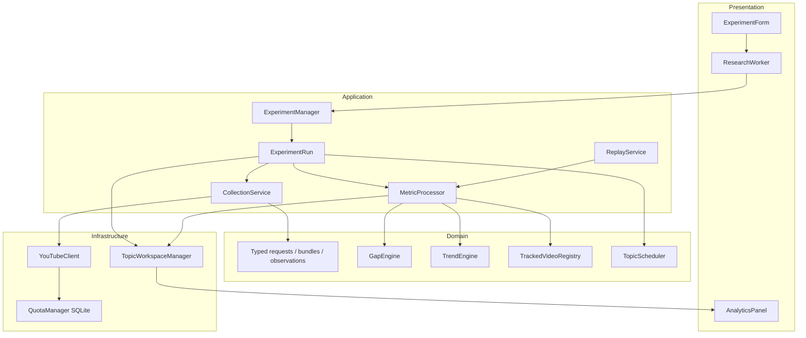

# Architecture

## Layers and dependency direction

Presentation (`gui*`, `__main__`) creates domain requests and dispatches application services. `ExperimentManager` validates, resolves every formula default, estimates and allocates a run. `ExperimentRun` owns cancellation, schedules and execution journaling. `MetricProcessor` owns independent engines and knows no network client. Infrastructure supplies immutable filesystem records, SQLite accounting and YouTube HTTP.

The original `metrics/engine.py` and `metrics/calculators.py` remain the Gap implementation. `research/gap.py` gives that engine an explicit name and contains the creator enrichment adapter. `research/trend.py` contains YouTube-only deterministic research components. Neither engine makes API calls.

## Domain contracts

`CandidateTopic` has a stable slug plus hash (collision-resistant even for punctuation variants), aliases, category, source, creation time, priority and monitoring state. Canonicalization is deterministic whitespace/case handling. No LLM is required. Aliases are metadata, not hidden extra searches.

`CollectionRequest` validates explicit UTC static bounds or positive rolling hours, page size/cap and overlap. `VideoIdentity` separates publication identity from `VideoObservation`, whose timestamp is the actual counter-read time. Optional counters remain None. `CollectionBundle` contains all raw discovery identities, successful statistics, collection metadata, endpoint telemetry and warnings. Creator eligibility never modifies it.

`ExperimentConfig` is saved as a full immutable snapshot, with resolved Gap/Trend parameter defaults and a canonical SHA256. Formula variants remain independent from raw data. `KnownEvent` is a separate evaluation contract with traceable source metadata. Its type is not an argument of `TrendEngine` or `GapEngine`.

## Ingestion boundaries

`YouTubeClient.get` is the only HTTP boundary. It accounts each attempted operation before transmission and writes sanitized telemetry afterward. Each retry is a separate quota debit. Search has a call budget; all currently supported other read endpoints cost one unit each. Unknown endpoints are rejected by the guard until their costs are defined. The API's own quota response stops the relevant workflow; there is no rotation.

`YouTubeDiscoveryCollector.collect` resolves bounds, follows page tokens, deduplicates IDs and reads details in bounded groups. Cancellation, quota blocks and API failures retain successful discovery identities and statistics already received. A failed later search page can leave earlier identities without statistics; this is persisted explicitly, not manufactured into a complete dataset.

`CollectionService` maintains per-run per-topic watermarks. Only complete uncapped discovery advances the watermark. A separate `track` operation receives registered IDs and only calls `videos.list`. Raw observation history is never deduplicated globally.

## Gap branch

`GapEnricher` batches channel lookups, bounds creator playlist reads, excludes all current thematic discovery IDs and batches baseline statistics. Its TTL cache is keyed by channel and contains uploads playlist ID, recent IDs, refresh timestamp and raw observations. Fresh entries do not make new calls. A cache may have too few usable videos after current-batch exclusion; the creator is ineligible until refresh, rather than silently lowering the minimum. Cached age is calculated at the cached observation timestamp. Changes to TTL/baseline policy are captured in experiment configuration.

The selected legacy `YouTubeBatch` is stored exclusively in the experiment's enrichment directory and checksummed. Gap's original formulas and `MetricsState` are unchanged. Its output now also carries original discovery batch size and collection status for interpretation. Missing optional counters are not silently filled for the research Gap branch.

## Trend branch

See FORMULAS.md for exact mappings and deliberate research adaptations. `TrendEnricher` accumulates unique publication identities and successful collection-coverage intervals. `TrendEngine` evaluates completed, non-overlapping event-time buckets. Repeated network polling does not count as new independent windows. Previously unseen overlapping IDs enter the same identity index.

A partial/capped request or uncovered bucket yields null activity and a diagnostic row, not zero. It does not enter the causal baseline and resets derivative continuity. G uses only prior positive slopes; Z uses prior log-EWMA median/MAD; breadth uses prior creator counts. Counter reaction ECDFs are separate coarse same-age cohorts. Tracking velocities do not get an extra weight in the core score.

Each topic has its own TrendState, registry and Gap state. `timestamp` in a live Trend row is the collection completion/decision time; `window_end` is the historical measurement bucket boundary. This prevents the event evaluator from treating an observation fetched later as an earlier real-time detection.

## Experiment lifecycle

`ExperimentManager.run` checks config/formulas/profile and the conservative plan before allocating or calling HTTP. `ExperimentRun` owns mutable state. Its methods separately choose due jobs, execute one cycle, capture Gap enrichment, record counts and finalize summaries. Stop/deadline checks bound the run; in-flight requests have a finite timeout. A final summary and quota report are written on normal completion, cancellation and processing failure.

The scheduler uses an explicit deterministic formula:

`priority_score = (base_priority + recent_signal + uncertainty + 0.1 * waiting) / max(estimated_search_pages, 1)`

`uncertainty = 1/(1+selection_count)` and `waiting = rounds_since_selection/topic_count`. Exploration slots occur when `floor(round*fraction)` increments and prefer least selected topics. Other slots maximize the score. Stable topic ID breaks ties. Feedback is the gated YouTube research score / 100, never a Known Event. The journal records reason, inputs and selected topic. Fixed heuristic weights are documented policy, not learned evidence.

Current tracking selection is a bounded deterministic recency/view-count shortlist per topic, including a research warm-up sample. It is not the notebook's production catalyst/activation policy: the production panel is unavailable. It is intentionally bounded by `tracked_limit` and the read quota.

## Persistence, concurrency and recovery

Raw files are immutable exclusive-create JSON records under each topic. Experiment manifests reference them by workspace-relative path and hash. Readers reject path traversal, corrupt JSON, unknown schemas and hash mismatches. Gap enrichment has a separate manifest and integrity checks. JSON state/summary updates use same-directory temporary files and atomic replacement. Metrics are append-only JSONL with CSV companions.

State/metrics live under experiment+topic, not a single global file. Replaying configurations never contaminates another run. Topic metadata/config history is separate from measurement data. SQLite `BEGIN IMMEDIATE` protects daily quota accounting across instances. Raw IDs and experiment IDs are UUID-based. Creator cache refresh is atomic but last-writer-wins across concurrent runs; losing a cache update can cause extra reads, not changed recorded raw inputs. Single-run journals and metric files have one writer.

There is no automatic live-process resume. Immutable completed observations can be replayed into fresh states. Partial filesystem failures are explicit errors; preserve evidence and repair through an explicit reader/schema migration. Schema 1 remains handled by the old CLI replay; schema 2 is never silently interpreted as schema 1.

## Replay and historical separation

`ReplayService` verifies raw/config/enrichment hashes, resolves overridden parameter sets, constructs fresh `MetricProcessor` state and writes a new experiment. It does not construct a YouTubeClient or QuotaManager and never repairs missing data over the network. Raw files stay byte-for-byte unchanged. Memory use is linear in raw experiment size during initial verification; very large archives may require a future streaming replay index.

`HistoricalAnalyzer` only bins publication identities in the selected static window; current counter values never enter these historical features. `EventEvaluator` works afterward on already calculated rows. A Known Event overlay changes neither raw data nor scores. It computes first rising/breakout/peak offsets and active-signal span; span includes gaps and is explicitly not a reconstructed continuous duration. No externally verified event catalog is bundled.

## GUI and extension points

Qt widgets contain no metric formulas. Worker signals carry progress/results; the main thread handles widgets. Closing during a run requests a safe stop and asks the user to close again after the request ends. Analytics reads persisted rows; null values create graph gaps. Two metric overlays are available; users should choose comparable scales. CSV/JSON exports are local.

To add another platform, create a real ingestion adapter producing honest normalized signals with coverage and event/observation timestamps. Version the source panel and normalization contract, then extend the processor. Do not fill absent platform slots with zero or silently renormalize production weights. To add a fixed discovery panel, record an actual eligible denominator before claiming incidence.
