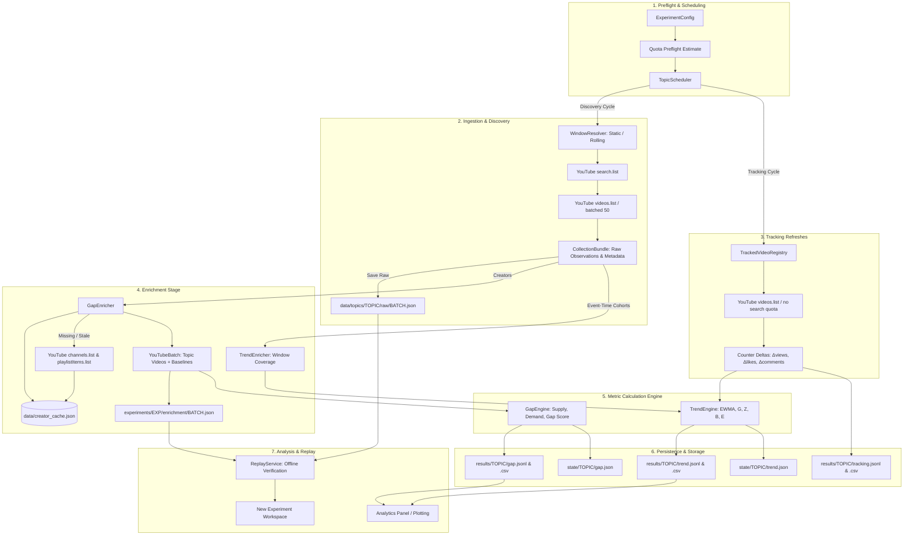
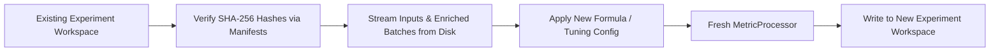

# CreatorRadar Research Data Pipeline

This document provides an end-to-end technical specification of the data pipeline in the CreatorRadar Research system. It explains how data flows from external YouTube Data API v3 endpoints, through ingestion, validation, enrichment, mathematical engines, isolated storage, and offline replay.

---

## 1. Pipeline Overview

The pipeline operates on a fundamental principle: **Raw observations are captured immutably first; metric calculations, creator baseline enrichments, and evaluation annotations are strictly separated.**



---

## 2. What Does "Enrichment" Mean in this Project?

### The Core Problem Enrichment Solves
When YouTube API `search.list` returns videos matching a query (e.g. "quantum computing" or "ai laptop"), it only returns surface-level metadata: current total view count, like count, comment count, and publication date.

However, **raw view count alone is scientifically meaningless for evaluating market demand or novelty**:
- If a video has 10,000 views in 24 hours, is that good or bad?
- If published by an unknown creator with 50 subscribers, 10,000 views indicates a **massive viral breakout** (high performance ratio).
- If published by a creator with 20 million subscribers who averages 2 million views per video, 10,000 views is an **underperforming flop** (low performance ratio).

To determine whether a topic has true audience demand or supply scarcity, raw observations must be **enriched with contextual baseline performance data**.

---

### A. Creator Baseline Enrichment (`GapEnricher`)

The primary enrichment mechanism is implemented by `research.metrics.gap.GapEnricher`. It augments each discovered topic video with the publishing creator's normal baseline performance.

#### Step-by-Step Enrichment Process

1. **Extract Channel Identifiers**:
   For each video in the raw `CollectionBundle`, extract the creator's `channel_id`.
2. **Consult Persistent Creator Cache**:
   The enricher inspects `data/creator_cache.json`. If a creator's cached entry is fresh (within `config.baseline_ttl_hours`, typically 168 hours / 7 days), the cached baseline is used immediately, avoiding redundant API calls.
3. **Fetch Creator Uploads Playlist**:
   For stale or new creators, call YouTube API `channels.list(part="contentDetails", id=channel_ids)` in batches of up to 50 channels. This extracts each channel's related `uploads` playlist ID (conventionally starting with `UU`).
4. **Collect Recent Upload Identifiers**:
   Call YouTube API `playlistItems.list(part="contentDetails", playlistId=uploads_id)` up to `baseline_pages` pages to retrieve the creator's recent video IDs.
5. **Anti-Contamination Exclusion Guard (Critical Rule)**:
   > [!IMPORTANT]
   > A video discovered in the current thematic search batch is **strictly excluded** from its creator's baseline calculation. A video can never act as its own baseline. This prevents circular contamination.
6. **Fetch Baseline Video Statistics**:
   Call `videos.list` (batched in chunks of 50) for the filtered baseline video IDs to retrieve their view counts and publication dates.
7. **Compute Creator Historical Baseline Rate**:
   For each baseline video $i$, compute its view rate:
   $$\text{rate}_i = \frac{\text{views}_i}{\max(\text{age\_hours}_i, 0) + \epsilon}$$
   The creator's expected baseline performance is the median of these baseline rates:
   $$\text{creator\_rate} = \text{median}\left( \{ \text{rate}_1, \text{rate}_2, \dots, \text{rate}_k \} \right)$$
8. **Enforce Creator Baseline Eligibility**:
   If a creator has fewer than `config.baseline_min` (default: 5) valid baseline videos, or if the current topic video lacks view/like/comment counts, the video is dropped from the Gap calculation.
9. **Construct and Persist Enriched Batch**:
   The qualifying videos are packaged into a `YouTubeBatch` (containing `RawTopicVideo` records with attached `RecentVideoStat` lists).
   - Saved to: `experiments/<id>/enrichment/<batch_id>.json` (compact JSON).
   - Fingerprinted with SHA-256 in: `experiments/<id>/enrichment_manifest.jsonl`.
10. **Cache Pruning and Maintenance**:
    `data/creator_cache.json` automatically prunes the oldest refreshed entries when exceeding capacity (`max_entries=1000`) and writes with compact serialization to prevent disk and memory growth.

#### Architectural Decoupling: Gap vs. Trend
> [!NOTE]
> **Enrichment failures never corrupt or drop discovery observations.**
> If `GapEnricher` encounters quota exhaustion or an ineligible creator, it issues a warning and skips the Gap snapshot for that batch. The raw `CollectionBundle` remains 100% intact, and the **Trend Engine** proceeds independently.

---

### B. Temporal Window Enrichment (`TrendEnricher`)

In `research.metrics.trend.TrendEnricher`, enrichment operates on the **time-series continuity of discovery observations**:

1. **Publication Identity Deduplication**:
   Accumulates unique `VideoIdentity` records across repeated polling cycles.
2. **Window Coverage Tracking**:
   Logs contiguous, valid discovery intervals $[T_{\text{start}}, T_{\text{end}}]$ from completed discovery cycles.
3. **Event-Time Bucketing**:
   Extracts all videos published within specific retroactive buckets (e.g. $[T - 24\text{h}, T)$ and $[T - \text{window\_hours}, T)$).
4. **Coverage Verification**:
   Before calculating Trend velocities or growth, `TrendEnricher.covered()` verifies that the time span has continuous, un-gapped discovery coverage. If data collection was truncated or stopped by quota, Trend outputs a diagnostic null rather than fabricating an artificially low view rate.

---

## 3. Detailed Data Pipeline Stages

### Stage 1: Preflight Validation & Quota Ledger

```
UI Form / Parameters
       │
       ▼
ExperimentManager.estimate()
       │
       ├─► QuotaManager (SQLite atomic read)
       │     Check: (today_usage + estimated_cost <= daily_budget)
       │
       └─► TopicScheduler (Exploration vs Exploitation Priority)
```

1. **Parameters Frozen**: `ExperimentConfig` is created and all formula defaults are resolved into immutable configuration dictionaries with an explicit SHA-256 fingerprint.
2. **Conservative Cost Preflight**: Worst-case API cost is calculated based on topic count, duration, discovery intervals, max pages, and baseline page allocations.
3. **SQLite Quota Ledger**: `QuotaManager` checks `data/quota.sqlite` under Pacific midnight boundary reset rules (`America/Los_Angeles`). If estimated cost exceeds available quota, execution is rejected before making a single network call.

---

### Stage 2: Discovery Ingestion

```
CollectionService.discover()
       │
       ▼
WindowResolver.resolve() (Rolling or Static UTC)
       │
       ▼
YouTubeDiscoveryCollector.collect()
       │
       ├─► search.list (paginated, bounded by max_pages)
       │     └─► Extract video IDs, deduplicate within batch
       │
       ├─► videos.list (part=snippet,statistics,contentDetails)
       │     └─► Chunked in batches of 50 IDs
       │
       └─► Filter: minimum_video_age_hours & minimum_views
             │
             ▼
      CollectionBundle (Raw observations + telemetry + warnings)
```

1. **Window Resolution**:
   - **Rolling Window**: Resolves $[T_{\text{now}} - H, T_{\text{now}} - \text{min\_age}]$.
   - **Static Window**: Fixed publication bounds $[T_1, T_2]$ for historical evaluation.
2. **Search Execution**: `search.list` traverses pages up to `max_pages` using token pagination.
3. **Batch Video Fetching**: Extracted video IDs are queried in batches of 50 via `videos.list`.
4. **Observation Assembly**: Each video is represented as a `VideoObservation` with full statistics.
5. **Persistence**:
   - Raw bundle saved to: `data/topics/<topic_id>/raw/<batch_id>.json`.
   - Referenced in: `experiments/<id>/inputs.jsonl` and `inputs_manifest.jsonl`.
   - Watermark updated to $T_{\text{effective\_to}}$ only upon complete, uncapped collection.

---

### Stage 3: Counter Tracking Ingestion

To compute true velocity derivatives ($\Delta \text{views} / \Delta t$) without burning expensive search quota, the pipeline uses **counter tracking**:

```
TrackedVideoRegistry (Shortlist of top active/recent video IDs)
       │
       ▼
CollectionService.track(video_ids)
       │
       ├─► videos.list (Direct video query: 1 quota unit per 50 IDs)
       │
       ▼
Compute Counter Deltas:
   Δviews    = current_views - previous_views
   Δlikes    = current_likes - previous_likes
   Δcomments = current_comments - previous_comments
   Δt        = current_time - previous_time
```

- Operates on a regular cadence (`tracking_minutes`, e.g., every 15 minutes).
- Never calls `search.list` (saving 100 quota units per call).
- Handles negative deltas gracefully as platform corrections or audit resets rather than negative rates.

---

### Stage 4: Metric Calculation Boundary (`MetricProcessor`)

The `MetricProcessor` is completely **network-free**. It accepts ingested bundles and enrichment batches, dispatching them to the mathematical engines:

#### Gap Engine Execution
1. Takes the enriched `YouTubeBatch` from `GapEnricher`.
2. Computes topic view rates and batch mean view rate.
3. Calculates Creator Authority: $\text{auth} = \text{creator\_rate} / (\text{topic\_rate} + \epsilon)$.
4. Normalizes Supply using extreme tail percentile anchors and EWMA state tracking.
5. Calculates Engagement Rate (ER) and Performance Ratio (PR) normalized demand.
6. Computes final **Gap Score**:
   $$\text{gap\_score} = \text{demand\_norm} \times (1.0 - \text{supply\_norm})$$

#### Trend Engine Execution
1. Takes raw `CollectionBundle` observations and counter tracking deltas.
2. Calculates EWMA activity rate ($r_t$) across completed event-time buckets:
   $$\alpha = 1 - 2^{-\Delta t / H}, \quad r_t = \alpha x_t + (1 - \alpha) r_{t-1}$$
3. Calculates velocity $v_t$ and acceleration $a_t$.
4. Computes Growth factor ($G$), Burst factor ($Z$ via median/MAD z-score), Breadth ($B$), and Engagement ($E$).
5. Evaluates research confidence ($N, D, F, M, O$) and evidence gates.
6. Produces the gated **YouTube Research Score** and lifecycle state (`WATCHING`, `RISING`, `BREAKOUT`, `PEAK`, `COOLING`).

---

### Stage 5: Storage Architecture & Artifacts

All outputs are isolated under workspace directories:

```text
CR_ytAPI/
├── data/
│   ├── creator_cache.json         # Bounded (≤1000) cached creator upload baselines
│   ├── quota.sqlite               # Persistent atomic quota ledger
│   ├── research.log               # Rotating file log (10MB x 3 backups)
│   └── topics/
│       └── <topic_id>/
│           └── raw/
│               └── <batch_id>.json # Immutable raw discovery bundle
│
└── experiments/
    └── <experiment_id>/
        ├── config.json            # Full snapshot of experiment configuration
        ├── runtime.json           # Clock and initial window resolution audit
        ├── inputs.jsonl           # Manifest of input batches
        ├── inputs_manifest.jsonl  # SHA-256 checksums of raw input bundles
        ├── enrichment/
        │   └── <batch_id>.json    # Enriched YouTubeBatch with creator baselines
        ├── enrichment_manifest.jsonl # SHA-256 checksums of enrichment files
        ├── events.jsonl           # Lifecycle events journal
        ├── telemetry.jsonl        # HTTP timing, status, endpoint audit
        ├── results/
        │   └── <topic_id>/
        │       ├── gap.jsonl      # Time-series Gap snapshot rows
        │       ├── gap.csv        # Companion CSV export (for external systems)
        │       ├── trend.jsonl    # Time-series Trend snapshot rows
        │       ├── trend.csv      # Companion CSV export (for external systems)
        │       ├── tracking.jsonl # Video-level counter deltas
        │       └── tracking.csv   # Companion CSV export (for external systems)
        ├── state/
        │   └── <topic_id>/
        │       ├── gap.json       # Serialized Gap Engine EMA state
        │       ├── trend.json     # Serialized Trend Engine state & history
        │       └── tracking.json  # Tracked video registry state
        ├── summary.json           # Run summary statistics and status
        └── product_report.json    # Product simulation report (PRODUCT mode)
```

---

## 6. Offline Replay Pipeline (`ReplayService`)

The offline replay system enables reproducible scientific experimentation without making any network requests:



1. **Zero Network Dependence**: Does not construct `YouTubeClient` or touch API quotas.
2. **Cryptographic Integrity**: Re-checks `inputs_manifest.jsonl` and `enrichment_manifest.jsonl` against files on disk.
3. **Parameter Comparison**: Allows running multiple formula presets (e.g. `trend_sensitive.json` vs. `trend_conservative.json`) on the exact same raw data to evaluate mathematical sensitivity.

---

## 7. Storage & Memory Optimizations Summary

| Mechanism | Implementation | Benefit |
|---|---|---|
| **Human-Friendly JSON** | `write_json(..., indent=2)` | Clean 2-space indentation by default for easy inspection |
| **Gzip Support** | Transparent `.json.gz` + magic byte `\x1f\x8b` detection | ~80% compression on disk for archival storage |
| **JSONL Streaming** | `iter_jsonl()` generator | Prevents multi-hundred megabyte heap bloat |
| **Temporary File Purging** | `cleanup_temporary_files()` + `try...finally` unlinking | Guarantees zero orphaned `.tmp` atomic write files |
| **Creator Cache Pruning** | `_prune_cache(max_entries=1000)` in `GapEnricher` | Prevents indefinite growth of `creator_cache.json` |
| **SQLite Connection Lifecycles**| `contextlib.closing(sqlite3.connect(...))` | Eliminates leaked OS file handles & Windows file locks |
| **HTTP Pool Lifecycles** | `YouTubeClient.close()` & context manager | Closes idle socket pools deterministically |
| **Bounded GUI Log** | `QPlainTextEdit.setMaximumBlockCount(1000)` | Bounds Qt text buffer memory during long runs |
| **Rotating Disk Log** | `RotatingFileHandler(10MB, backupCount=3)` | Caps `data/research.log` disk footprint |
| **Preserved CSVs** | `results/<topic_id>/<kind>.csv` | Preserves integration with external projects |
